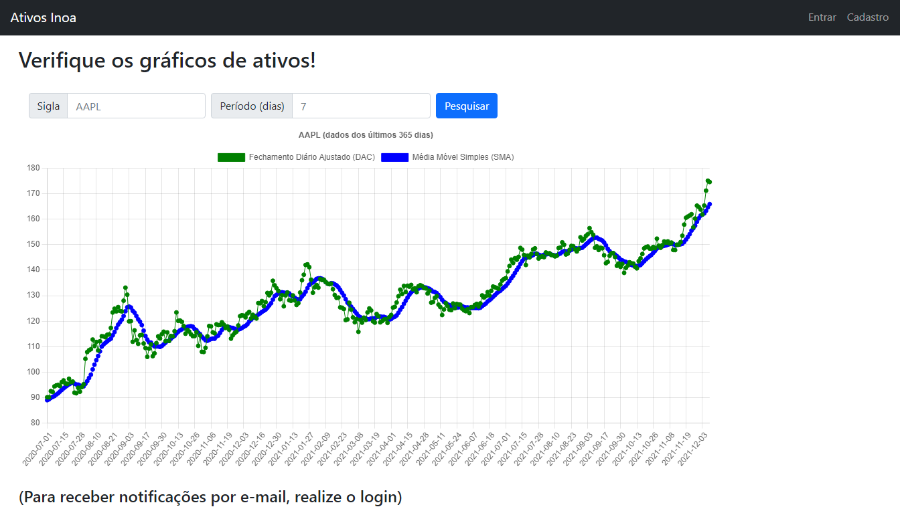

# Desafio Inoa

## Objetivo
Desenvolver um sistema de auxilio de compra/venda de ativos utilizando Django e Python.

## Requisitos
O objetivo do sistema é auxiliar um investidor nas suas decisões de comprar/vender ativos. Para tal, ele deve registrar periodicamente a cotação atual de ativos da B3 e também avisar, via e-mail, caso haja oportunidade de negociação.

Os seguintes requisitos funcionais são necessários:

- Obter periodicamente as cotações de alguma fonte pública qualquer e armazená-las, em uma periodicidade configurável, para consulta posterior

- Expor uma interface web para permitir consultar os preços armazenados, configurar os ativos a serem monitorados e parametrizar os túneis de preço de cada ativo

- Enviar e-mail para o investidor sugerindo Compra sempre que o preço de um ativo monitorado cruzar o seu limite inferior, e sugerindo Venda sempre que o preço de um ativo monitorado cruzar o seu limite superior

Pedimos que o sistema seja feito em Python com Django, assim você já vai conhecendo as tecnologias principais que nós usamos no dia a dia. 

Features extras são bem vindas, boas práticas e patterns também 😉

Estamos disponíveis para tirar dúvidas, tanto sobre o escopo quanto a tecnologia.

## Checklist
- [X] Login
- [X] Gráfico
- [X] Ativos atualizam periodicamente
- [X] Cotações periodicas dos ativos (visualização em D/M/A)
- [X] Consulta de preços
- [X] E-mail ao usuário sugerindo compra/venda

## Instruções

Para rodar o programa, basta rodar o ambiente virtual que foi criado:

```
venv\Scripts\activate.bat
```

Em seguida realizar o comando para iniciar o servidor do Django:

```
py manage.py runserver
```

E agora, basta entrar em seu servidor local (provavlemente o **http://127.0.0.1:8000/**)

## Features

Para facilitar, mostrarei um *overview* da entrega.

### Páginas e funcionalidades:

Primeiramente, temos a *home* do site, ela é o elemento principal, dado que tem o gráfico e as funcionalidades desejadas.

<div align="center">
  <br>
</div>
<p  align="center">
  <c style="font-size:11px">Imagens 1, 2 e 3: Tutorial de como exportar uma conversa do WhatsApp</c>
</p>
