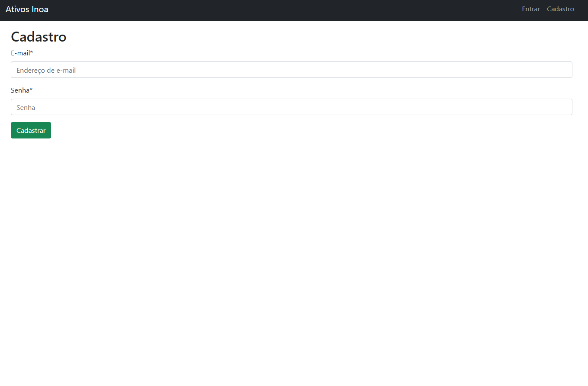
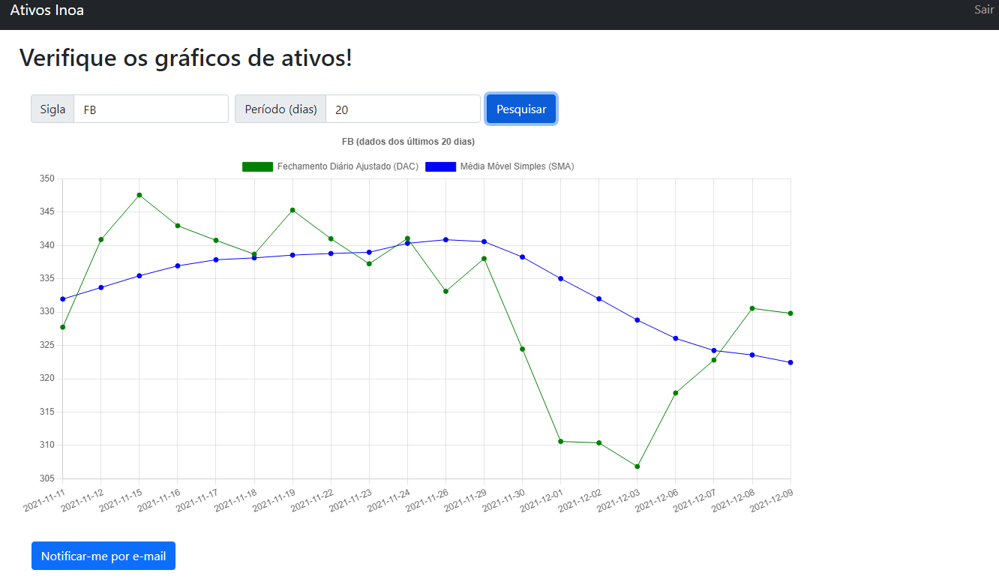
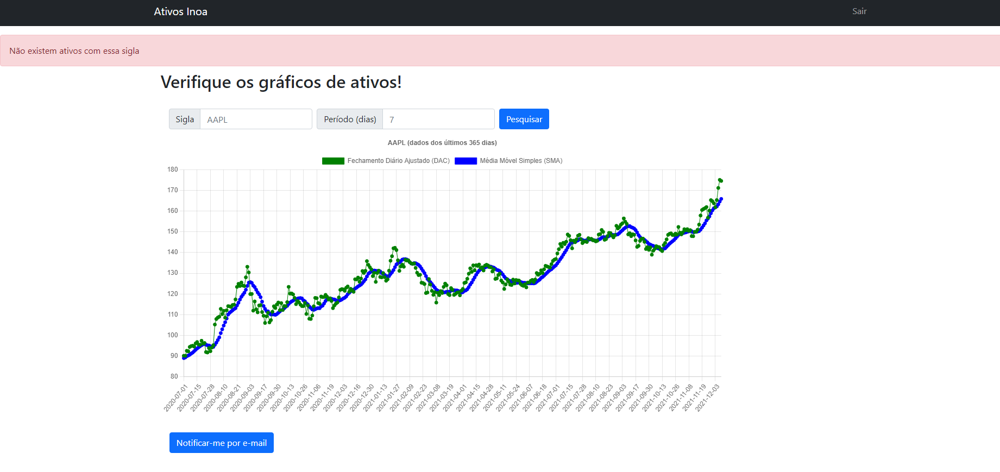
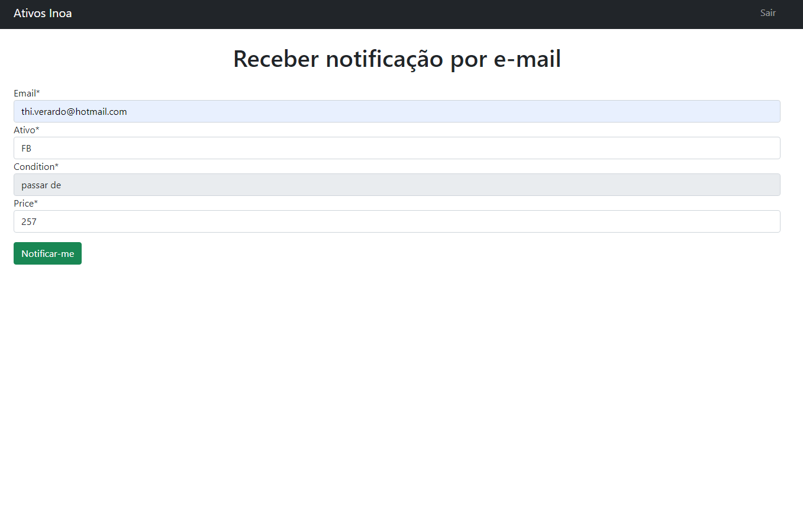
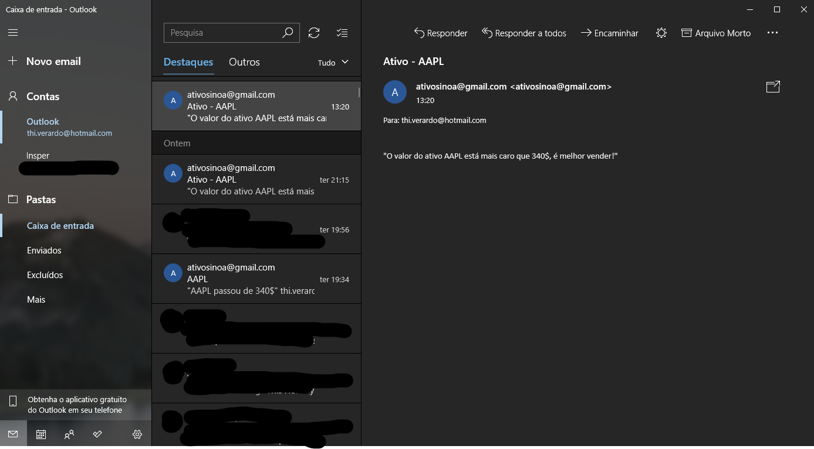

# Desafio Inoa

## Objetivo
Desenvolver um sistema de auxilio de compra/venda de ativos utilizando Django e Python.

## Requisitos
O objetivo do sistema é auxiliar um investidor nas suas decisões de comprar/vender ativos. Para tal, ele deve registrar periodicamente a cotação atual de ativos da B3 e também avisar, via e-mail, caso haja oportunidade de negociação.

Os seguintes requisitos funcionais são necessários:

- Obter periodicamente as cotações de alguma fonte pública qualquer e armazená-las, em uma periodicidade configurável, para consulta posterior

- Expor uma interface web para permitir consultar os preços armazenados, configurar os ativos a serem monitorados e parametrizar os túneis de preço de cada ativo

- Enviar e-mail para o investidor sugerindo Compra sempre que o preço de um ativo monitorado cruzar o seu limite inferior, e sugerindo Venda sempre que o preço de um ativo monitorado cruzar o seu limite superior

Pedimos que o sistema seja feito em Python com Django, assim você já vai conhecendo as tecnologias principais que nós usamos no dia a dia. 

Features extras são bem vindas, boas práticas e patterns também 😉

Estamos disponíveis para tirar dúvidas, tanto sobre o escopo quanto a tecnologia.

## Checklist
- [X] Login
- [X] Gráfico
- [X] Ativos atualizam periodicamente
- [X] Cotações periodicas dos ativos (visualização em D/M/A)
- [X] Consulta de preços
- [X] E-mail ao usuário sugerindo compra/venda

## Instruções

Para rodar o programa, basta rodar o ambiente virtual que foi criado:

```
venv\Scripts\activate.bat
```

Em seguida realizar o comando para iniciar o servidor do Django:

```
py manage.py runserver
```

E agora, basta entrar em seu servidor local (provavlemente o **http://127.0.0.1:8000/**)

## Features

Para facilitar, mostrarei um *overview* da entrega.

### Páginas e funcionalidades:

Primeiramente, temos a *home* do site, ela é o elemento principal, dado que tem o gráfico e as funcionalidades desejadas.

<div align="center">
  <br>
</div>
<p  align="center">
  <c style="font-size:11px">Imagem 1: Home</c>
</p>

Em seguida, as funcionalidades de *login* e cadastro para o usuário conseguir receber notificações por e-mail;

<div align="center">
  <br>
  <br>
</div>
<p  align="center">
  <c style="font-size:11px">Imagens 2 e 3: login e cadastro</c>
</p>

Ao realizar o cadastro, o usuário pode pedir por gráficos diferentes e em períodos desejados.

<div align="center">
  <br>
</div>
<p  align="center">
  <c style="font-size:11px">Imagem 4: home com o login efetuado e filtrando o gráfico de ativos</c>
</p>

Caso o usuário digite algo errado ou não exista o que ele deseja pesquisar, uma mensagem de erro irá aparecer.

<div align="center">
  <br>
</div>
<p  align="center">
  <c style="font-size:11px">Imagem 5: Erro</c>
</p>

Ao analisar os gráficos desejados, o usuário pode ser encaminhado para a pagina de notificação por e-mail.

<div align="center">
  <br>
</div>
<p  align="center">
  <c style="font-size:11px">Imagem 6: home com o login efetuado e filtrando o gráfico de ativos</c>
</p>

Por fim, se o usuário preencher o formulário, um e-mail chegará em sua caixa de entrada assim que as condições forem cumpridas;

<div align="center">
  <br>
</div>
<p  align="center">
  <c style="font-size:11px">Imagem 7: Exemplo de e-mail</c>
</p>

## Observações finais

O projeto foi bem divertido de fazer, poucas vezes precisei quebrar a cabeça para resolver algum problema. O tempo foi um inimigo, dado que trabalhei no projeto muito menos do que imaginei.

Tudo que foi pedido eu consegui realizar, menos a parte de notificação periódica do e-mail. Consegui criar a função que checa o preço da ação de 12 em 12 horas, mas não integrei com o disparo de e-mails.

O formulário apenas envia o e-mail na hora que é solicitado, não computa nada.

Uma observação importante foi que eu utilizei um arquivo ```.env``` para não disponibilizar as informações desse email "ativosinoa@gmail.com" que criei para esse projeto.

Outra observação é que, caso estejam faltando algumas dependências, o arquivo [pip](pip.txt) está disponível no repositório.

Por fim, não subi a aplicação em nenhum servidor (como um da AWS) pois não foi expecificado no e-mail.

No mais é isso, espero que goste do resultado.
